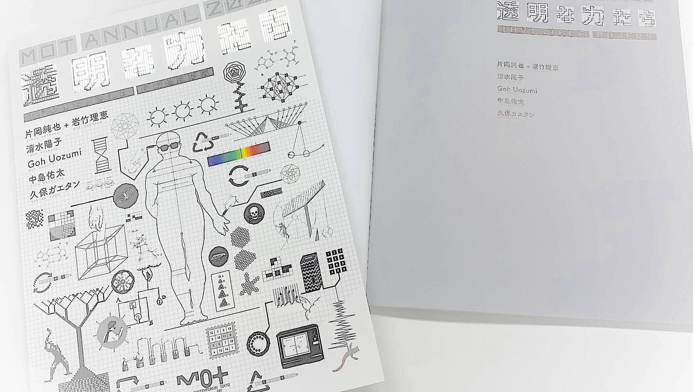

On a PC, the table of contents is displayed on the right side, and on a smartphone, the TOC is displayed by tapping. You can switch languages.  The table of contents is an internal link

There is a tide in the affairs of men. Which, taken at the flood, leads on to fortune; Omitted, all the voyage of their life. Is bound in shallows and in miseries. There is a tide in the affairs of men. Which, taken at the flood, leads on to fortune; Omitted, all the voyage of their life. Is bound in shallows and in miseries.

There is a tide in the affairs of men. Which, taken at the flood, leads on to fortune; Omitted, all the voyage of their life. Is bound in shallows and in miseries.

## 思考の質量．こう見出しを入れると目次が生成される

<iframe width="560" height="315" src="https://www.youtube.com/embed/E3d2mSpk1yg" frameborder="0" allow="accelerometer; autoplay; clipboard-write; encrypted-media; gyroscope; picture-in-picture" allowfullscreen=""></iframe>

動画はYoutubeやVimeoを埋め込む

There is a tide in the affairs of men. Which, taken at the flood, leads on to fortune; Omitted, all the voyage of their life. Is bound in shallows and in miseries. There is a tide in the affairs of men. Which, taken at the flood, leads on to fortune; Omitted, all the voyage of their life. Is bound in shallows and in miseries.

## 暗号戦争と敗北の歴史

There is a tide in the affairs of men. Which, taken at the flood, leads on to fortune; Omitted, all the voyage of their life. Is bound in shallows and in miseries.

<iframe width="560" height="315" src="https://www.youtube.com/embed/E3d2mSpk1yg" frameborder="0" allow="accelerometer; autoplay; clipboard-write; encrypted-media; gyroscope; picture-in-picture" allowfullscreen=""></iframe>

以下のように見出しは階層化される．大見出し内の小見出し，みたいな．以下はHTMLでいうH3タグ

### Virtual Virtual Coins（これはH3タグ

There is a tide in the affairs of men. Which, taken at the flood, leads on to fortune; Omitted, all the voyage of their life. Is bound in shallows and in miseries. There is a tide in the affairs of men. Which, taken at the flood, leads on to fortune; Omitted, all the voyage of their life. Is bound in shallows and in miseries.

### Finding Number

There is a tide in the affairs of men. Which, taken at the flood, leads on to fortune; Omitted, all the voyage of their life. Is bound in shallows and in miseries. There is a tide in the affairs of men. Which, taken at the flood, leads on to fortune; Omitted, all the voyage of their life. Is bound in shallows and in miseries.

## 見出しはリンクになってるので色々つかえる．

音声は，SoundcloudとかSpotifyを埋め込む

<iframe width="100%" height="166" scrolling="no" frameborder="no" allow="autoplay" src="https://w.soundcloud.com/player/?url=https%3A//api.soundcloud.com/tracks/244475642&amp;color=%23ff5500&amp;auto_play=false&amp;hide_related=false&amp;show_comments=true&amp;show_user=true&amp;show_reposts=false&amp;show_teaser=true"></iframe>

<a href="https://soundcloud.com/ghostly" title="ghostly" target="_blank" style="color: #cccccc; text-decoration: none;">ghostly</a> · <a href="https://soundcloud.com/ghostly/beacon-better-or-worse-1" title="Beacon - Better Or Worse" target="_blank" style="color: #cccccc; text-decoration: none;">Beacon - Better Or Worse</a>

<iframe src="https://open.spotify.com/embed/track/2O7heTmxheKOe1T0jNBPd1" width="300" height="380" frameborder="0" allowtransparency="true" allow="encrypted-media"></iframe>

見出しを作品ごとにつくると，展示会場でも使える各作品のウェブガイドをつくることもできます．

まず目次をクリックすると，ブラウザでURLに目次名が追加されます．その状態の全部のURLをコピーして，QRコードにします．するとQRを撮ったら，このページ内の各作品の見出しへ移動します．

上記のようにSoundcloudを貼り付けると音声ガイドになります．Youtubeで作家が喋っている動画を貼るのでもいいです．ウェブページなので何でもできます．

ただScriptタグは貼り付けられないです．

## AGAME

There is a tide in the affairs of men. Which, taken at the flood, leads on to fortune; Omitted, all the voyage of their life. Is bound in shallows and in miseries.　There is a tide in the affairs of men. Which, taken at the flood, leads on to fortune; Omitted, all the voyage of their life. Is bound in shallows and in miseries.

という感じで行ける

---

## 展覧会の図録

<a class="card" href="http://www.nadiff-online.com/?pid=156665274" target="_blank" rel="noopener noreferrer">      
     <h4>書籍 ― MOTアニュアル2020「透明な力たち INVISIBLE POWERS」</h4>      
日本語と英語で書かれた展覧会の図録は Nadiff-onlineショップ からご購入いただけます．
     
2,200円
    
 </a>

<!--  -->

<!-- 寄付が不要なら，ここから下は全部消す -->

---

## 支援する

支援を募れます．
 この記事は非営利で作成されました，だから支援してねみたいなことを入れられます． 不要ならなしで．

### A．翻訳する

このサイトの特徴は，コミュニティ翻訳を受け入れられることです．Gitlocalizeを使って第三者が翻訳に参加できます．日本語を元記事として，その多言語化を不特定多数の人が行えます．
 ここには翻訳を募る場合に，それへの簡易説明と詳細リンクを入れます．
 これ👉 [Gitlocalize](https://gitlocalize.com/repo/5849)

### B. Buy me a coffee

Machine translation.... Donations can be collected for each article. Feel free to write a message about donations here.  <small>* In order to make it easier to get money and to avoid the complexity of the tax system, we often get donations in the form of "getting coffee" on the web.</small>

<!-- この下にDonorboxの埋め込みコードをいれる -->

<iframe allowpaymentrequest="" frameborder="0" height="900px" name="donorbox" scrolling="no" seamless="seamless" src="https://donorbox.org/embed/mot-commons-goh?default_interval=o&amp;amount=300" style="max-width: 500px; min-width: 310px; max-height:none!important" width="100%"></iframe> <comment></comment>

寄付のサービスは，上記のように [Donorbox](https://donorbox.org) を想定しています．個人でアカウントを作れて，日本円やドルの複数通貨に対応しています．
 このデモページでは，日本語と英語でそれぞれ別の寄付ボタンをつくっています（言語を切り替えると色が変わるのでわかると思います）．翻訳者に分配する時に，どの寄付ボタンから入金されたかを判別するためです．
