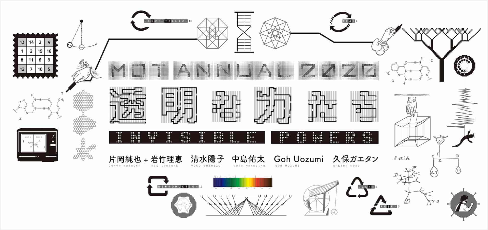

## 360° Virtual Tour

<!-- 
<iframe src="https://file.goh.works/app-files/index.html" title="dummy"  width="100%" height="500px" class="expansion-width"></iframe>-->

<iframe src="https://file.goh.works/spatial-media/invisible-powers/junya-kataoka+rie-iwatake/index.html" title="dummy"  width="100%" height="500px" class="expansion-width" style="margin-bottom:0px"></iframe>

<small class="caption-center">* 右上の「✕ボタン」で全画面表示になります．| ©2021 MOT Commons & 撮影者（CreativeCommonsで公開したいですね</small>

主催 公益財団法人東京都歴史文化財団 東京都現代美術館

協力
リカシツ、理科室蒸留所、関谷理化株式会社、独立行政法人国立科学博物館、東京大学地震研究所、オーストリア文化フォーラム東京

<!--  -->

<iframe width="560" height="315" src="https://www.youtube.com/embed/E3d2mSpk1yg" title="YouTube video player" frameborder="0" allow="accelerometer; autoplay; clipboard-write; encrypted-media; gyroscope; picture-in-picture" allowfullscreen style="margin-bottom:0px"></iframe>

<small class="caption-center">©2021 撮影者 ???（権利ってどうなってるんでしたけ</small>

## 展覧会について

展覧会の公式ウェブサイトより抜粋  
-https://www.mot-art-museum.jp/exhibitions/mot-annual-2020/

**若手作家の作品を中心に、現代美術の一側面を切り取り、問いかけや議論のはじまりを引き出すグループ展、MOT アニュアル。第16 回目となる本展では、人や物を動かしている自然界や社会の中の不可視の力の作用に着目し、そのメカニズムを再構築しようと試みるアーティスト 5 組を紹介します。**

私たちの身の周りには目に見えない数多の力が働き、複雑な世界の様相を作り出しています。例えば、物の動きに直接影響を与える重力や磁力や摩擦、生き物の性質や行動に作用する DNA 等にその力が認められるでしょう。また、私たちの社会を動かし形作る諸システムやルール、そしてその背景にある人々の思考、意識、感情、固定概念も不可視の力と呼べるかも知れません。研究や業務の上での専門性が細分化した今日、世界を取り巻く仕組みをひとりひとりが認識し、頭にいれておくことは不可能に近いといえます。情報化社会が進むと同時に見えにくくなる、あるいは隠される仕組みも増えています。情報を反射神経的に認識・処理するようなスピード感が求められ、そこにどのような力が働いているか、意識されることは多くありません。  
  
本展では、物ごとを動かし変化させるメカニズムを咀嚼しなおし、自分の手で、あるいは誰かと協働して、再構築する作家とともに、私たちを取り巻く透明な力について考察いたします。彼らの試みは、ときにミクロコスモス的な箱庭や実験室を連想させ、現実とは離れた系の中でものごとが自律的に動いているように見えます。しかしそれは私たちの立っている「あたりまえ」の地盤に視線を向けさせ、いくつもの要因が複雑に重なり動いている世界の様子をそれぞれの角度から垣間見せてくれるものです。これらのユニークな実践の中で、可視化された透明な力が各々の感覚を揺さぶり、見慣れた風景を再考するためのささやかな契機となれば幸いです。    

| 展覧会 | MOTアニュアル2020 - 透明な力たち |
----|---- 
| 会期 | 2020年11月14日（土）－ 2021年2月14日（日）|
| 会場 | 東京都現代美術館 企画展示室 3F |
| 企画・構成 | 小高日香理 |
| 学芸スタッフ | 楠本愛 |
| 広報 | 中島三保子 |
| 主催 | 公益財団法人東京都歴史文化財団 東京都現代美術館 |

<!-- | アーティスト | 片岡純也＋岩竹理恵 清水陽子 中島佑太 Goh Uozumi 久保ガエタン | -->

---

## アーティスト

各作家へのリンク

    <a href="/test" class="btn btn-border-shadow btn-border-shadow--yellow bold">
    片岡純也＋岩竹理恵
    </a>

    <a href="/test" class="btn btn-border-shadow btn-border-shadow--yellow bold">
    清水陽子 
    </a>

    <a href="/test" class="btn btn-border-shadow btn-border-shadow--yellow bold">
    中島佑太
    </a>

    <a href="/test" class="btn btn-border-shadow btn-border-shadow--yellow bold">
    Goh Uozumi - New Economic War 
    </a>

    <a href="/test" class="btn btn-border-shadow btn-border-shadow--yellow bold">
    久保ガエタン
    </a>

<iframe width="560" height="315" src="https://www.youtube.com/embed/E3d2mSpk1yg" title="YouTube video player" frameborder="0" allow="accelerometer; autoplay; clipboard-write; encrypted-media; gyroscope; picture-in-picture" allowfullscreen style="margin-bottom:0px"></iframe>

<small class="caption-center">©2021 撮影者 ???（権利ってどうなってるんでしたけ</small>

---

## 展覧会のカタログ

目次

クレジット（図録より

## 謝辞

<iframe src="/spatial-media/invisible-powers/junya-kataoka+rie-iwatake/index.html" title="dummy"  width="100%" height="500px" class="expansion-width"></iframe>

<iframe src="/spatial-media/invisible-powers/goh-uozumi/index.html" title="dummy"  width="100%" height="500px" class="expansion-width"></iframe>

<iframe src="/spatial-media/invisible-powers/gaetan-kubo/index.html" title="dummy"  width="100%" height="500px" class="expansion-width"></iframe>

<!-- 

<iframe src="https://file.goh.works/spatial-media/invisible-powers/goh-uozumi/index.html" title="dummy" width="100%" height="500px" class="expansion-width"></iframe>

<iframe src="https://file.goh.works/spatial-media/invisible-powers/gaetan-kubo/index.html" title="dummy"  width="100%" height="500px" class="expansion-width"></iframe> -->

<!-- 展覧会全体のページでは，各360°コンテンツを繋げて一つにして埋め込みます．  
いまは試験的に作家別のコンテンツを別々に下記に入れています（複数埋め込んでるからスマホだと重いかも）  
また各作家ページに下記のように自分の分だけ埋め込むこともできます．

これは展覧会のページです．ここに展覧会の全体についてや，360°コンテンツ，MOTが作ってくれた展示全体の動画や，各作家へのリンク，MOT展示ページへのリンクなどを貼ります．
ページの構成は考え中です．

MOTアニュアル2020　透明な力たち
2020年11月14日（土）－ 2021年2月14日（日

若手作家の作品を中心に、現代美術の一側面を切り取り、問いかけや議✕論のはじまりを引き出すグループ展、MOT アニュアル。第 16 回目となる本展では、人や物を動かしている自然界や社会の中の不可視の力の作用に着目し、そのメカニズムを再構築しようと試みるアーティスト 5 組を紹介します。

私たちの身の周りには目に見えない数多の力が働き、複雑な世界の様相を作り出しています。例えば、物の動きに直接影響を与える重力や磁力や摩擦、生き物の性質や行動に作用する DNA 等にその力が認められるでしょう。また、私たちの社会を動かし形作る諸システムやルール、そしてその背景にある人々の思考、意識、．．．．．．

 -->
